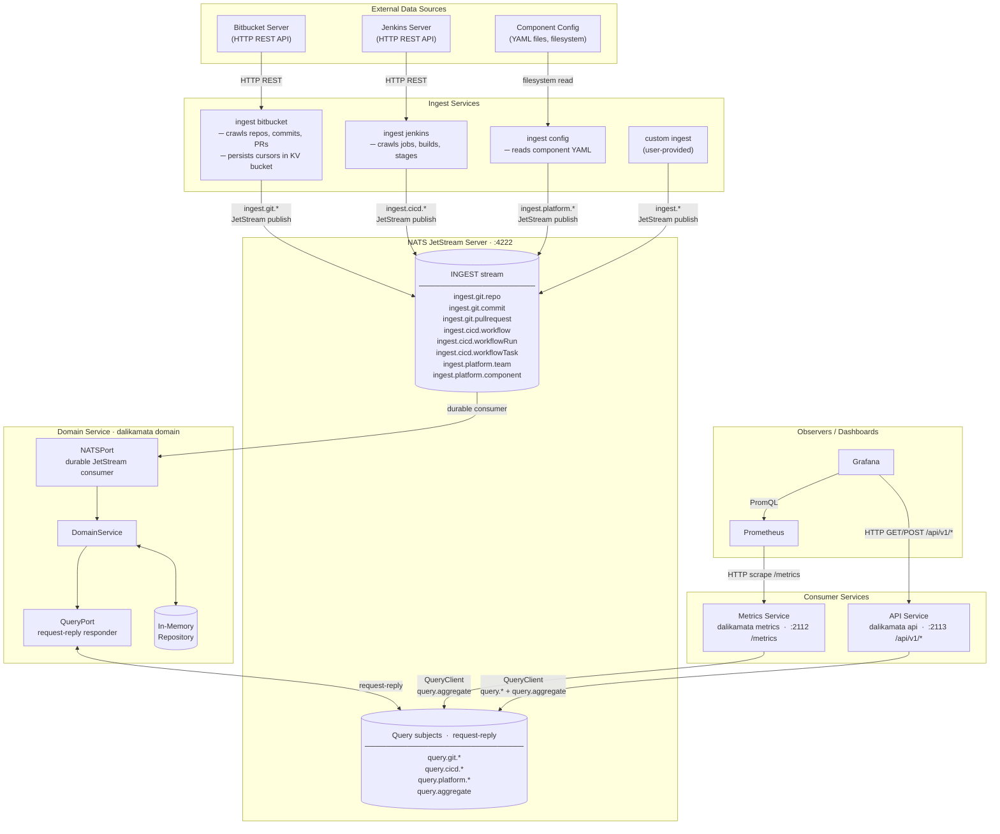

# Services Overview

This diagram shows all microservices, their communication channels, and how metrics are produced.

## Communication protocols

| Channel | Protocol | Direction |
|---|---|---|
| Ingest crawlers → NATS | NATS JetStream publish | crawlers push events to the `INGEST` durable stream |
| NATS → Domain (`NATSPort`) | JetStream durable consumer | domain pulls from the stream at its own pace |
| Domain (`QueryPort`) ↔ NATS | Core NATS request-reply | QueryPort subscribes to `query.*` and `query.aggregate`; callers use `QueryClient` to send requests and receive streamed replies |
| Metrics / API → Domain | Core NATS request-reply (via `QueryClient`) | services send a `query.Query` JSON body; domain streams back `data` messages then a `done` sentinel, each with a `Daka-Query-Status` header |
| Prometheus → Metrics | HTTP scrape `/metrics` | Prometheus polls on its configured interval; responses are served from a pre-computed cache updated every `--metric-refresh-interval` |
| Grafana → API | HTTP GET / POST `/api/v1/*` | Grafana Infinity datasource drives live queries; supports filter, sort, pagination, and enriched `team_name` / `component_name` labels |
| Grafana → Prometheus | PromQL | standard Prometheus datasource for histogram dashboards |

## Extension points

**Custom ingest sources** — any service that publishes to the established subject hierarchy (`ingest.git.*`, `ingest.cicd.*`, `ingest.platform.*`) using the `pkg/model` types is immediately consumed by the domain without any changes to the core codebase (see [ADR-001](ADR-001-microservices-event-driven.md)).

**Custom metrics services** — any service that connects to NATS and issues queries via `QueryClient` can read the accumulated domain state and expose its own Prometheus metrics or HTTP endpoints.

**Custom storage backends** — implementing `domain.Repository` and `domain.QueryRepository` in a new adapter (e.g. SQLite, PostgreSQL) and wiring it in `internal/app/domain.go` is the only change required; the NATS ports and all crawlers are unaffected (see [ADR-002](ADR-002-onion-architecture.md)).
